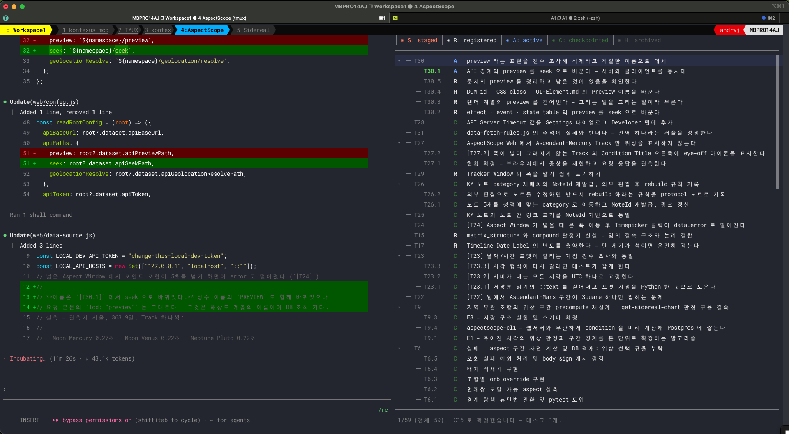
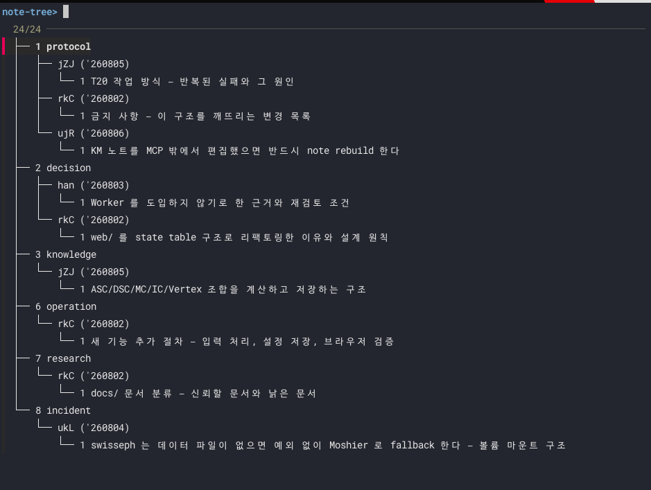
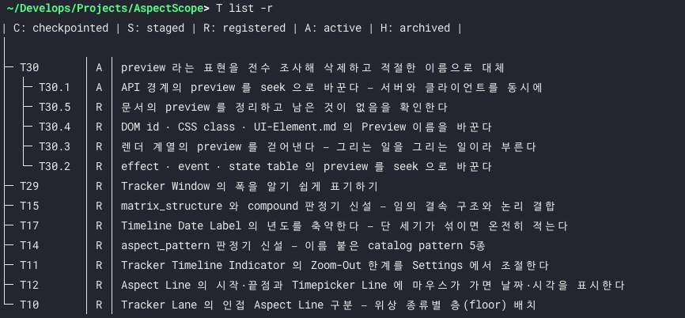

# kontexus-mcp

AI coding agent의 작업 문맥을 프로젝트 안에 오래 남기는 도구입니다. 세션이 끊기거나 대화가 잘려도 태스크, 결정, 노트, 체크포인트가 남아 있어 이전 작업 지점으로 돌아갈 수 있습니다.

배포물은 실행파일 두 개입니다.

| 실행파일       | 하는 일                                                                                  |
| -------------- | ---------------------------------------------------------------------------------------- |
| `kontexus-mcp` | AI agent가 붙는 MCP server. Codex, Claude, opencode, Antigravity IDE에서 도구로 부릅니다 |
| `kontexus-cli` | 사람이 직접 쓰는 CLI. 저장소 초기화, 태스크·노트 관리, 체크포인트                        |

---

## 1. 설치

이 배포본의 실행파일은 **macOS(Apple Silicon)** 용입니다. Linux·Windows 빌드는 요청이 많거나 비용을 지급할 의사가 있는 개발자·회사에 제공합니다.

압축을 푼 디렉터리에서 `install.sh`를 실행합니다. 실행파일을 `$HOME/.local/bin`으로 옮깁니다.

```bash
cd <압축을-푼-디렉터리>
./install.sh
```

무엇이 일어나는지 먼저 보려면 `--dry-run`을 주십시오. 아무것도 바꾸지 않고 실행할 명령만 출력합니다.

```bash
./install.sh --dry-run
```

macOS에서 내려받은 파일에 붙는 quarantine 속성은 `install.sh`가 `xattr -c`로 지우므로 따로 손댈 것이 없습니다.

### PATH 확인

`$HOME/.local/bin`이 `PATH`에 없으면 셸 설정 파일(`~/.zshrc` 또는 `~/.bashrc`)에 다음 줄을 넣고 셸을 다시 여십시오.

```bash
export PATH="$HOME/.local/bin:$PATH"
```

설치를 확인합니다.

```bash
kontexus-cli version
kontexus-cli            # 인자 없이 실행하면 전체 사용법이 나옵니다
```

### 필수 유틸리티 설치

**`kontexus-cli`는 혼자 돌지 않습니다.** 목록을 고르고 편집하는 대화형 화면이 외부 유틸리티를 씁니다. `doctor`가 무엇이 있고 무엇이 없는지 실측해 알려 주므로 **설치 직후 반드시 한 번 실행하십시오.**

```bash
kontexus-cli doctor
```

출력은 이렇습니다.

```
Summary: ok
Platform: darwin arm64

Runtime
  ok      execution  native binary
  ok      runtime    0.9.3
  ok      sqlite     sqlite 3.46.0

Required
  ok      fzf     /opt/homebrew/bin/fzf (version 0.74.2)
  ok      dialog  /opt/homebrew/bin/dialog

Recommended
  ok      git      /opt/homebrew/bin/git
  ok      jq       /opt/homebrew/bin/jq
  ok      sqlite3  /usr/bin/sqlite3
  ok      editor   nvim
```

`Required` 항목이 하나라도 `ok`가 아니면 그 기능이 동작하지 않습니다.

| 구분        | 항목      | 없으면                                                                             |
| ----------- | --------- | ---------------------------------------------------------------------------------- |
| Required    | `fzf`     | `note list`·`task list --fef` 같은 대화형 목록이 열리지 않습니다                   |
| Required    | `dialog`  | 노트 대화형 흐름의 입력 창이 열리지 않습니다                                       |
| Recommended | `git`     | 저장소 위치를 git 루트에서 찾는 기능이 동작하지 않습니다                           |
| Recommended | `jq`      | `--jq` 출력이 동작하지 않습니다                                                    |
| Recommended | `sqlite3` | 색인을 직접 들여다볼 수 없습니다                                                   |
| Recommended | `editor`  | `task edit`·`note edit`가 편집기를 열지 못합니다. 아래 "편집기 설정"을 보십시오 |

설치 명령은 `doctor` 출력 아래쪽 `Guide`에 OS별로 나옵니다.

```bash
# macOS
brew install fzf dialog jq sqlite

# Debian/Ubuntu
sudo apt install fzf dialog jq sqlite3

# Fedora
sudo dnf install fzf dialog jq sqlite

# Arch
sudo pacman -S fzf dialog jq sqlite
```

Windows는 WSL을 권합니다. Linux 배포판 안에서 위 목록을 설치하십시오.

실행에 필요한 언어 런타임은 없습니다. SQLite는 바이너리 안에 들어 있어 따로 설치할 필요가 없습니다.

### 편집기 설정

편집기를 여는 명령들은 `VISUAL`을 먼저 보고, 없으면 `EDITOR`를 봅니다. 둘 다 없으면 `task edit`은 이렇게 거부합니다.

```
task edit requires VISUAL or EDITOR. Set VISUAL or EDITOR to your editor command.
```

kontexus는 편집기를 띄운 뒤 **그 프로세스가 끝나기를 기다렸다가** 파일이 바뀌었는지 보고 색인을 다시 만듭니다. 그러니 편집기가 바로 반환되지 않고 창을 닫을 때까지 붙잡혀 있어야 합니다.

```bash
export EDITOR="vim"      # 터미널 편집기는 그대로 두면 됩니다
export EDITOR="nvim"
export EDITOR="nano"
```

> **VS Code를 쓰신다면 `--wait`를 반드시 붙이십시오.**
>
> ```bash
> export EDITOR="code --wait"     # 또는 export VISUAL="code --wait"
> ```
>
> `--wait` 없이 `code`만 넣으면 창은 열리지만 명령이 **즉시 반환됩니다.** kontexus는 그 순간 파일을 다시 읽어 보고 "바뀐 것이 없다"고 판단한 뒤 끝냅니다. 여러분이 나중에 창에서 고쳐 저장하면 파일 자체는 바뀌지만 **색인은 갱신되지 않아** `task list`·`note list`에는 고치기 전 내용이 그대로 남습니다.
>
> 결과는 이렇게 갈립니다.
>
> ```
> code --wait  →  "changed": true,  "rebuild": [ ... ]
> code         →  "changed": false, "rebuild": []
> ```
>
> 이미 그렇게 편집하셨다면 `kontexus-cli rebuild all`로 색인을 맞추면 됩니다.

같은 이유로 창을 띄우고 바로 반환하는 다른 편집기도 대기 옵션이 필요합니다.

| 편집기         | 설정할 값                                            |
| -------------- | ---------------------------------------------------- |
| VS Code        | `code --wait`                                        |
| Cursor         | `cursor --wait`                                      |
| Sublime Text   | `subl -w`                                            |
| Zed            | `zed --wait`                                         |
| JetBrains 계열 | `idea --wait` (제품에 따라 실행파일 이름이 다릅니다) |

값은 공백으로 나뉘어 실행되므로 옵션을 그대로 넣으면 됩니다. 설정한 뒤 셸을 다시 열고 확인하십시오.

```bash
echo "$VISUAL" "$EDITOR"
kontexus-cli doctor | grep editor
```

### tmux 권장

kontexus를 쓰는 방식은 보통 이렇습니다 — 한쪽 창에서 AI agent와 대화하고, 다른 창에서 `kontexus-cli`로 태스크와 노트를 봅니다. 여기에 tmux가 잘 맞습니다.



왼쪽에서 agent가 코드를 고치는 동안 오른쪽 `task filter`에는 그 작업의 태스크가 상태와 함께 떠 있습니다. 위쪽 범례의 `S`·`R`·`A`·`C`가 각각 staged·registered·active·checkpointed입니다.

| 항목      | 이유                                                                                |
| --------- | ----------------------------------------------------------------------------------- |
| 창 나누기 | agent와 `task filter`를 나란히 두고 봅니다                                          |
| 세션 유지 | 터미널을 닫거나 SSH가 끊겨도 agent 세션이 살아 있습니다. `tmux attach`로 돌아옵니다 |
| 긴 작업   | 오래 도는 빌드나 테스트를 다른 pane에 두고 그동안 태스크를 정리합니다               |

```bash
# macOS
brew install tmux

# Debian/Ubuntu
sudo apt install tmux
```

기본 사용법입니다.

```bash
tmux new -s work      # 'work' 라는 이름으로 세션 시작
tmux attach -t work   # 나갔다가 돌아오기
tmux ls               # 세션 목록
```

세션 안에서 `Ctrl-b` 다음 `%`는 좌우로, `"`는 위아래로 창을 나눕니다. `d`를 누르면 세션을 살려 둔 채 빠져나옵니다.

#### 설정

tmux의 기본 설정은 손볼 곳이 많습니다. 직접 만들기보다 잘 다듬어진 것을 가져다 쓰는 편이 낫습니다.

**→ <https://github.com/gpakosz/.tmux>**

```bash
git clone https://github.com/gpakosz/.tmux.git ~/.tmux
ln -s -f ~/.tmux/.tmux.conf ~/.tmux.conf
cp ~/.tmux/.tmux.conf.local ~/.tmux.conf.local
```

`~/.tmux.conf.local`이 여러분이 고칠 파일입니다. 원본(`~/.tmux.conf`)은 건드리지 않아야 나중에 `git pull`로 갱신할 수 있습니다.

#### 마우스에 관한 주의

tmux의 마우스 모드와 `kontexus-cli task filter --mouse`는 **둘 다 마우스를 캡처합니다.** 캡처된 상태에서는 터미널에서 드래그로 글자를 복사할 수 없습니다. 화면 내용을 복사해야 한다면 `--mouse` 없이 `task filter`를 여십시오.

---

## 2. 저장소 초기화

kontexus는 프로젝트마다 `.workgraph` 디렉터리 하나에 모든 기록을 담습니다. 프로젝트 루트에서 실행하십시오.

```bash
cd <프로젝트-루트>
kontexus-cli init
```

| 옵션                    | 뜻                                    |
| ----------------------- | ------------------------------------- |
| `--project-name <이름>` | 프로젝트 이름. 기본값은 디렉터리 이름 |
| `--project-type <slug>` | 프로젝트 타입. 식별용 자유 문자열     |
| `--storage <dir>`       | 만들 위치를 직접 지정                 |
| `--force`               | 기존 파일이 있어도 덮어씀             |

`--storage`를 주지 않으면 이 순서로 위치를 정합니다.

1. 환경변수 `KONTEXUS_STORAGE`
2. git repository 루트의 `.workgraph`
3. 현재 디렉터리의 `.workgraph`

만들어진 위치는 다음 명령으로 확인합니다.

```bash
kontexus-cli info
```

### 원본은 파일입니다

`.workgraph` 안에서 **원본은 Markdown·YAML 파일이고, sqlite는 그 파일들에서 만들어 낸 색인일 뿐입니다.**

```
.workgraph/
├── tasks/T43/task.md          ← 태스크 원본
├── tasks/T43/1/task.md        ← 턴 태스크 원본
├── notes/0,rQv,1.md           ← 노트 원본
├── notes/kontexus-note.yaml   ← 노트 설정 원본
├── chat/                      ← 대화 기록 원본
├── checkpoints/  journal/  tracks/
│
├── workgraph.sqlite           ← 파생 색인. 지워도 다시 만들 수 있습니다
└── index.sqlite               ← 파생 색인
```

이 구조가 뜻하는 바는 이렇습니다.

| 항목               | 영향                                                               |
| ------------------ | ------------------------------------------------------------------ |
| 원본이 텍스트 파일 | git에 그대로 커밋하고 diff로 읽습니다. 편집기로 직접 고쳐도 됩니다 |
| sqlite는 파생물    | 깨지거나 지워져도 기록이 사라지지 않습니다                         |
| 조회는 sqlite를 봄 | 파일을 직접 고친 뒤에는 색인을 다시 만들어야 목록에 반영됩니다     |

### 색인 다시 만들기 (rebuild)

파일을 직접 고쳤거나, 다른 기계에서 `git pull`로 받았거나, 목록과 실제 파일이 일치하지 않으면 `rebuild`를 실행하십시오. 파일에서 sqlite를 다시 만듭니다. 원본은 건드리지 않습니다.

```bash
kontexus-cli rebuild all          # 전부 (target 생략과 같습니다)
kontexus-cli rebuild all-task     # 태스크만
kontexus-cli rebuild all-note     # 노트만
kontexus-cli rebuild chat         # 대화 기록만
kontexus-cli rebuild checkpoint   # checkpoint만
kontexus-cli rebuild journal      # journal만
kontexus-cli rebuild T16          # 그 태스크 하나만
```

여러 개를 한 번에 줄 수도 있습니다.

```bash
kontexus-cli rebuild all-task all-note
```

**`rebuild`는 언제 실행해도 안전합니다.** 원본에서 다시 계산하는 것이라 잃을 것이 없습니다. 무언가 이상하면 먼저 `rebuild all`을 해 보십시오.

### sqlite 파일을 지워 버렸다면

`rebuild`는 색인의 **내용**을 다시 채우는 것이지 색인의 **틀**을 만드는 것이 아닙니다. `workgraph.sqlite`를 통째로 지우면 `rebuild`가 이렇게 중단됩니다.

```
[kontexus-cli] error: sqlite 오류: no such table: schema_migrations
```

이때는 틀을 먼저 다시 만든 뒤 채웁니다.

```bash
kontexus-cli init --force --project-name <원래-프로젝트-이름>
kontexus-cli rebuild all
```

`--force`는 `context.yaml` 같은 설정 파일을 덮어쓰므로 `--project-name`에 원래 이름을 반드시 함께 주십시오. **태스크·노트·대화 기록 파일은 그대로 남습니다.** 위 두 줄이면 목록이 전부 돌아옵니다.

---

## 3. 노트 초기화

> **노트를 하나라도 쓰기 전에 이 절을 끝까지 마치십시오.** 노트 식별자는 birthday를 기준으로 계산되므로, 나중에 birthday를 바꾸면 이미 발급된 식별자가 엉뚱한 날짜를 가리키게 됩니다. 되돌릴 방법이 없습니다.

kontexus의 노트는 Kontexus Note 방법론을 따릅니다. 식별자가 곧 분류와 날짜입니다.

```
0,rQv,1
│  │  └── 그 날의 몇 번째 노트인가
│  └───── fingerprint - birthday로부터 며칠째인가를 3글자로 인코딩한 값
└──────── category 번호
```

`fingerprint`는 날짜 자체가 아니라 **birthday로부터의 경과 일수**입니다. 그래서 birthday가 무엇이냐에 따라 같은 날짜의 표현이 완전히 달라집니다.

| birthday     | `2026-08-09`의 fingerprint |
| ------------ | -------------------------- |
| `2026-08-09` | `rQv`                      |
| `2026-01-01` | `fDh`                      |

### 3.1 기준 날짜(birthday) 지정

노트 식별자의 기준이 되는 날짜입니다. 프로젝트 시작일을 넣으십시오.

```bash
kontexus-cli note config set-birthday 2026-08-09
```

**한 번 정하면 바꾸지 마십시오.** 바꿔도 막지 않지만 다음 일이 일어납니다.

- **이미 발급된 노트의 식별자는 바뀌지 않습니다.** 파일 이름 그대로 남습니다.
- 그러나 그 식별자를 되읽는 기준은 새 birthday가 됩니다. `2026-08-09`에 쓴 노트 `0,rQv,1`을 birthday `2026-01-01`로 바꾼 뒤 `kontexus-cli note id rQv`로 되읽으면 `2026-01-01`이 나옵니다. 실제 작성일과 다릅니다.
- 그 뒤에 쓰는 노트는 새 기준으로 발급되므로, 한 저장소 안에 기준이 다른 식별자가 섞입니다. 어느 것이 어느 기준인지 구분할 방법이 없습니다.

`set-birthday`를 실행하면 `sealed`가 `false`로 돌아갑니다. 3.3을 다시 해야 합니다.

### 3.2 category 수정

**category는 seal하기 전에 자신의 목적에 맞게 고치십시오.** seal한 뒤에는 이미 그 번호로 쓴 노트들이 쌓이기 시작하므로, 나중에 번호의 뜻을 바꾸면 과거 노트의 분류가 실제 내용과 일치하지 않게 됩니다.

`.workgraph/notes/kontexus-note.yaml`을 편집합니다. category 추가·수정·삭제 전용 하위 명령은 없습니다.

기본으로 만들어지는 category 10개입니다. 그대로 써도 되고, 프로젝트에 맞게 이름과 설명을 바꿔도 됩니다.

| 번호 | 이름       | 담는 것                                    |
| ---- | ---------- | ------------------------------------------ |
| 0    | inbox      | 분류가 확정되지 않은 임시 포착             |
| 1    | protocol   | 반드시 따라야 하는 규칙, 금지사항, 행동 경계 |
| 2    | decision   | 방향·범위·기술 선택의 확정 결정과 근거     |
| 3    | knowledge  | 반복 참조할 개념, 동작 원리, 주의점        |
| 4    | debt       | 지금 해결하지 않기로 한 한계와 상환 조건   |
| 5    | spec       | 요구사항, 인터페이스, 데이터 모델, 스키마  |
| 6    | operation  | 빌드·배포·환경 구성처럼 순서대로 하는 절차 |
| 7    | research   | 측정, 벤치마크, PoC, 현황 조사             |
| 8    | incident   | 버그·장애의 증상, 재현, 원인, 재발 방지    |
| 9    | governance | 기록 체계 자체를 바꾸는 운영 결정          |

### 3.3 seal

birthday와 category를 확정한 뒤 seal 합니다.

```bash
kontexus-cli note config seal
```

이제 노트를 씁니다.

```bash
kontexus-cli note add -c 0 -t "첫 노트" --content "내용"
kontexus-cli note list --format tree
kontexus-cli note tree
```

`--format` 없이 터미널에서 부르면 화면이 열립니다.

| 명령 | 열리는 것 |
| --- | --- |
| `note tree` | 트리를 접었다 폈다 하며 고르는 화면. 거기서 바로 편집·삭제 |
| `note search` | 본문에서 찾습니다 |
| `note search --title` · `note list` | 제목에서 찾습니다 |

`note tree` 는 `--fef` 를 인자로 받기는 하지만 쓰지 않습니다. `--format` 을 주지 않고 터미널에서 부르면 그것만으로 열립니다.



`note tree`는 category → fingerprint → 노트 차례로 접어 보여 줍니다. `jZJ ('260805')`처럼 fingerprint 옆에 그 날짜가 함께 나오므로, 3.1에서 정한 birthday가 무엇이었는지에 따라 같은 날이 다른 세 글자로 보입니다.

### seal 상태 확인

note 명령을 부르면 첫 줄에 상태가 나옵니다.

| 표시       | 뜻                                            |
| ---------- | --------------------------------------------- |
| `sealed`   | seal 완료. 정상 상태                          |
| `unsealed` | 아직 seal 전이거나 `set-birthday`로 해제된 상태 |

`unsealed` 상태에서는 `note list`·`note tree`·`note search`·`note category`가 `Unknown command`로 거부됩니다.

**그런데 `note add`는 거부되지 않습니다.** seal 전에도 노트가 써지고, 그때 발급되는 식별자는 기본 birthday `1970-01-01` 기준입니다. 나중에 제대로 된 birthday로 seal하면 그 노트들만 기준이 다른 채로 남아 목록의 날짜가 실제 작성일과 달라집니다. 그래서 이 절을 먼저 마치라고 하는 것입니다.

날짜와 fingerprint는 언제든 서로 확인할 수 있습니다.

```bash
kontexus-cli note id 2026-08-09    # 날짜 → fingerprint
kontexus-cli note id rQv           # fingerprint → 날짜
```

### 식별자 규칙

노트를 이어 쓰거나 갈라 쓰면 식별자가 자랍니다. **자라는 방식이 곧 관계입니다.**

세 번째 조각부터는 **숫자와 영문자가 번갈아** 옵니다. 영문자는 대소문자를 가리지 않고 한 글자이고, 숫자는 다음 영문자가 나올 때까지 하나로 묶입니다.

```
0,jgn,1        처음 쓴 노트
0,jgn,1a       이어 쓴 것        — 숫자 뒤라 영문자가 붙는다
0,jgn,1a1      또 이어 쓴 것      — 영문자 뒤라 숫자가 붙는다
0,jgn,1a1a     또 이어 쓴 것
0,jgn,1,a      1 에서 갈라 나온 것 — 콤마 뒤에 새 조각이 열린다
0,jgn,1,a1     그 갈래를 이어 쓴 것
```

| 붙는 방식 | 뜻 | 만드는 법 |
| --- | --- | --- |
| 콤마 **없이** 숫자나 영문자 | 같은 줄기를 이어 씀 | `note add --parent <NoteId> --continue` |
| 콤마 **뒤에** 새 조각 | 그 지점에서 갈라 나옴 | `note add --parent <NoteId> --fork` |

`note tree`로 보면 이 관계가 그대로 계층이 됩니다.

```
1                root
├── 1a               c1
│   └── 1a1              c2
│       └── 1a1a             c3
└── a                f1
    └── a1               f2
```

### 숫자와 영문자의 경계

앞 두 조각(category·fingerprint)은 통짜로 읽습니다. **세 번째 조각부터는 숫자와 영문자가 바뀌는 곳이 계층 경계**입니다.

| 식별자 | 펼친 계층 |
| --- | --- |
| `1a1b` | `1` → `1a` → `1a1` → `1a1b` |
| `12a3` | `12` → `12a` → `12a3` |

`12`가 `1`·`2`로 갈라지지 않는 것이 "숫자는 다음 영문자 전까지 하나"라는 규칙입니다. 반대로 영문자는 언제나 한 글자라 두 글자가 잇달아 오지 않습니다.

| 조각 | 쓰이는 글자 |
| --- | --- |
| category | 한 자릿수 `0`~`9` |
| fingerprint | 세 글자. 첫 글자는 소문자 24자(`l`·`o` 제외), 둘째·셋째는 그 24자에 대문자 24자(`I`·`O` 제외)를 더한 48자 |
| 그 뒤 | 숫자런과 영문자 한 글자가 번갈아 |

`l`·`o`·`I`·`O`를 뺀 것은 `1`·`0`과 눈으로 구분되지 않기 때문입니다. 세 글자로 만들 수 있는 날은 `24 × 48 × 48 = 55,296`일, 곧 birthday로부터 약 151년입니다.

이 규칙 덕에 `note id`는 인자를 보고 무엇을 할지 스스로 정합니다 — 세 글자 fingerprint 꼴이면 날짜로 풀고, 그 밖에는 날짜로 보고 fingerprint를 만듭니다.

---

## 4. MCP 등록

`kontexus-cli config <대상>`이 각 도구에 맞는 설정 조각을 출력합니다. **출력에는 현재 디렉터리 기준의 저장소 경로가 이미 박혀 있으므로 프로젝트 루트에서 실행하십시오.**

```bash
cd <프로젝트-루트>
kontexus-cli config codex
kontexus-cli config claude
kontexus-cli config opencode
kontexus-cli config gemini
```

### 4.1 Codex CLI

명령으로 등록하는 것이 가장 간단합니다.

```bash
codex mcp add kontexus-mcp \
  --env KONTEXUS_STORAGE=$(pwd)/.workgraph \
  -- kontexus-mcp
```

직접 편집하려면 `~/.codex/config.toml`에 `kontexus-cli config codex`의 출력을 붙여 넣습니다.

```toml
[mcp_servers.kontexus-mcp]
command = "kontexus-mcp"
env.KONTEXUS_STORAGE = "/절대경로/프로젝트/.workgraph"
```

대화 기록을 남기려면 Stop hook 도 함께 걸어야 합니다 — 5.2 를 보십시오.

### 4.2 Claude CLI

```bash
claude mcp add kontexus-mcp \
  -s project \
  -e KONTEXUS_STORAGE=$(pwd)/.workgraph \
  -- kontexus-mcp
```

`-s`는 적용 범위입니다 - `project`는 그 프로젝트에만, `user`는 모든 프로젝트에 적용됩니다.

직접 편집하려면 `kontexus-cli config claude`의 출력을 설정 파일에 넣습니다.

```json
{
  "mcpServers": {
    "kontexus-mcp": {
      "command": "kontexus-mcp",
      "env": {
        "KONTEXUS_STORAGE": "/절대경로/프로젝트/.workgraph"
      }
    }
  }
}
```

대화 기록을 남기려면 Stop hook 도 함께 걸어야 합니다 — 5.1 을 보십시오.

### 4.3 opencode CLI

`~/.config/opencode/opencode.json`의 `mcp` 항목에 `kontexus-cli config opencode`의 출력을 넣습니다.

```json
{
  "mcp": {
    "kontexus-mcp": {
      "enabled": true,
      "type": "local",
      "command": [
        "kontexus-mcp",
        "--opencode"
      ],
      "environment": {
        "KONTEXUS_STORAGE": "/절대경로/프로젝트/.workgraph"
      }
    }
  }
}
```

`--opencode`를 빠뜨리지 마십시오. opencode가 기대하는 응답 형식에 맞추는 옵션입니다.

### 4.4 Antigravity IDE

`~/.gemini/antigravity-ide/mcp_config.json`의 `mcpServers` 항목에 넣습니다. 형식이 Claude와 같으므로 `kontexus-cli config claude`의 출력을 그대로 씁니다.

```json
{
  "mcpServers": {
    "kontexus-mcp": {
      "command": "kontexus-mcp",
      "env": {
        "KONTEXUS_STORAGE": "/절대경로/프로젝트/.workgraph"
      }
    }
  }
}
```

이미 다른 MCP server가 등록되어 있으면 `mcpServers` 안에 항목만 더하십시오. 파일 전체를 덮어쓰면 기존 등록이 삭제됩니다. 편집 후 Antigravity IDE를 다시 시작해야 적용됩니다.

### 4.5 Gemini CLI

```json
{
  "kontexus-mcp": {
    "command": "kontexus-mcp",
    "args": ["--gemini"],
    "env": {
      "KONTEXUS_STORAGE": "/절대경로/프로젝트/.workgraph"
    },
    "disabled": false
  }
}
```

---

## 5. 대화 기록 저장 (Stop hook)

> **이 절을 건너뛰면 대화가 저장되지 않습니다.** MCP 등록은 agent가 kontexus의 도구를 부를 수 있게 할 뿐이고, 주고받은 대화 자체를 남기는 것은 Stop hook입니다. 세션이 끊긴 뒤 `search_chat`으로 되살릴 수 있는 것은 여기서 저장된 것뿐입니다.

Stop hook은 agent가 한 턴을 마칠 때마다 `kontexus-cli chat hook`을 실행합니다. 그 명령이 지금 도는 agent를 검출해 그 턴의 대화를 `.workgraph`에 밀어 넣습니다.

```
agent가 턴을 마침 → Stop hook 실행 → kontexus-cli chat hook
                                        → Claude Code 면 transcript 를 읽어 import
                                        → 그 밖이면 Codex 최신 thread 를 import
```

### 5.1 Claude Code

`kontexus-cli config claude settings`의 출력을 프로젝트의 `.claude/settings.json`에 넣습니다. 배포물의 `.claude/settings.json`이 그 예시입니다.

```json
{
  "hooks": {
    "Stop": [
      {
        "hooks": [
          {
            "type": "command",
            "command": "kontexus-cli chat hook",
            "timeout": 60
          }
        ]
      }
    ]
  },
  "permissions": {
    "defaultMode": "bypassPermissions"
  }
}
```

`permissions`가 필요 없다면 `kontexus-cli config claude hook`의 출력을 쓰십시오. `hooks`만 들어 있습니다.

**이미 `settings.json`이 있으면 `Stop` 배열에 항목만 더하십시오.** 파일을 통째로 덮어쓰면 기존 hook이 사라집니다.

### 5.2 Codex CLI

`kontexus-cli config codex hook`의 출력을 `~/.codex/hooks.json`에 넣습니다. 배포물의 `.codex/hooks.json`이 그 예시입니다.

```json
{
  "hooks": {
    "Stop": [
      {
        "hooks": [
          {
            "type": "command",
            "command": "kontexus-cli chat hook",
            "timeout": 60,
            "statusMessage": "Exporting latest Codex thread"
          }
        ]
      }
    ]
  }
}
```

### 5.3 그 밖의 agent — 직접 import

`chat hook`이 스스로 가리는 것은 **Claude Code 와 Codex 둘뿐입니다.** opencode·Antigravity IDE·Gemini에는 이 hook을 걸지 마십시오. 걸면 지금 도는 agent가 아니라 Codex의 마지막 thread를 가져옵니다.

대신 필요할 때 직접 부릅니다.

```bash
kontexus-cli chat import-antigravity        # Antigravity IDE transcript
kontexus-cli chat import-from <파일 경로>   # markdown transcript 파일
kontexus-cli chat import-claude             # Claude 세션(--update 로 upsert)
kontexus-cli chat import-codex              # Codex 최신 thread
```

### 5.4 저장되는지 확인

hook을 걸어도 **capture가 꺼져 있으면 아무것도 저장되지 않습니다.** `chat hook`이 가장 먼저 보는 것이 이 상태입니다.

```bash
kontexus-cli chat capture status     # chat capture enabled 여야 합니다
kontexus-cli chat capture enable     # 꺼져 있으면
```

설정한 뒤 agent와 한 턴 대화하고 저장됐는지 봅니다.

```bash
kontexus-cli chat list --format text
kontexus-cli chat search "방금 말한 낱말"
```

| 증상 | 확인할 것 |
| --- | --- |
| 목록이 비어 있음 | `chat capture status`가 `enabled`인지 |
| 그래도 비어 있음 | `which kontexus-cli`로 hook이 부를 실행파일이 PATH에 있는지 |
| Claude인데 Codex 것이 들어옴 | `chat hook` 대신 다른 hook이 걸려 있는지, 또는 5.3 대상에 hook을 건 것은 아닌지 |

---

## 6. `#FTM` 지시자

MCP를 등록하면 AI agent가 kontexus의 도구를 부를 수 있게 됩니다. 그중 `structure_reasoning`은 agent의 **판단**을 구조로 남기는 도구입니다 - 무엇이 사실이고 무엇이 가정이며 어떤 규칙으로 다음 상태를 유도했는지를 기록합니다.

프롬프트에 `#FTM`을 붙이면 agent가 답을 내기 전에 그 도구를 반드시 부릅니다. 세 단계가 있습니다.

| 지시자          | 요구하는 것                                                            | 쓰는 빈도   |
| --------------- | ---------------------------------------------------------------------- | ----------- |
| `#FTM`          | 판단을 구조로 남길 것                                                  | 자주        |
| `#FTM:verified` | 위에 더해, "이 성질을 지켰다"는 주장마다 실제로 돌린 검사에 연결할 것  | 드물게      |
| `#FTM:strict`   | 위에 더해, 실행한 파일 수정·명령마다 그것을 승인한 작업 단위를 적을 것 | 아주 드물게 |

윗단계는 아랫단계를 포함합니다. 나란한 선택지가 아니라 겹쳐 쌓이는 세 층입니다.

```
#FTM 이 캐시 무효화를 이벤트 기반으로 바꿀지 TTL로 둘지 판단해 주십시오.
```

어느 것을 고를지는 위에서부터 읽어 내려가다 처음 "예"가 나오는 지점에서 멈추십시오.

1. 되돌리기 어려운 실행이 섞여 있고, 각 실행이 어느 작업에 속했는지 나중에 반드시 가려야 합니까? → `#FTM:strict`
2. 동작이 그대로 유지되어야 하는데 눈으로는 다 확인할 수 없는 조합이 있습니까? → `#FTM:verified`
3. 판단의 갈림이 있고 나중에 되짚을 일이 있습니까? → `#FTM`
4. 그 밖에는 아무것도 붙이지 마십시오.

**습관적으로 붙이지 마십시오.** 전부에 붙이면 경고가 배경 소음이 되어 정작 중요한 지점에서 눈에 들어오지 않습니다. 세션의 첫 요청에 한 번 붙이면 되고, 매 프롬프트에 반복할 필요가 없습니다.

각 단계가 정확히 무엇을 검사하는지, 어길 때 어떤 경고가 붙는지, 붙이지 말아야 할 작업은 무엇인지는 함께 들어 있는 문서를 보십시오.

**→ [`FTM-DIRECTIVES.md`](FTM-DIRECTIVES.md)**

### 함께 든 AGENT 지침 파일

배포물에는 `CLAUDE.local.md` 가 들어 있습니다. AI agent 가 이 도구를 어떤 규율로 쓸지 적어 둔 지침이며, `AGENTS.md` 는 같은 파일을 가리키는 symlink 입니다. 프로젝트 루트에 두면 Claude Code 와 Codex 가 각각 읽습니다.

**쓰기 전에 이름 두 개를 바꾸십시오.** 예시로 넣어 둔 값이 그대로 남아 있으면 agent 가 여러분이 아닌 다른 사람을 사용자로 알고 움직입니다.

| 예시 값 | 뜻                   | 무엇으로 바꾸나             |
| ------- | -------------------- | --------------------------- |
| `G선생` | agent 를 부르는 이름 | 여러분이 agent 를 부를 이름 |
| `A.J`   | 사용자 이름          | 여러분의 이름이나 호칭      |

두 이름은 파일 곳곳에 흩어져 있으므로 한 번에 바꾸십시오.

```bash
sed -i '' 's/G선생/<agent 이름>/g; s/A\.J/<내 이름>/g' CLAUDE.local.md   # macOS
sed -i    's/G선생/<agent 이름>/g; s/A\.J/<내 이름>/g' CLAUDE.local.md   # Linux
```

바꾼 뒤 남은 것이 없는지 확인합니다.

```bash
grep -n 'G선생\|A\.J' CLAUDE.local.md
```

이름 말고도 이 파일은 **각자의 작업 방식에 맞게 고쳐 쓰는 것이 전제**입니다. 응답 어투, 금지 표현 표, Turn 을 나누는 기준은 모두 한 사람의 취향으로 적힌 것이므로 그대로 따를 이유가 없습니다. 규율의 뼈대(TaskID 발급 규칙, 결속 순서, 기록 누적)만 남기고 나머지는 바꾸십시오.

---

## 7. TaskID 발급 규칙

kontexus의 태스크 식별자는 **반드시 발급 절차를 거쳐야 합니다.** 번호를 임의로 정해 쓸 수 없습니다.

| 종류        | 형태    | 뜻                                              |
| ----------- | ------- | ----------------------------------------------- |
| 루트 태스크 | `T16`   | 하나의 독립된 작업 묶음                         |
| 턴 태스크   | `T16.1` | 그 루트 아래의 실행 단위. 마지막 점 뒤는 숫자만 |



`T30` 아래 `T30.1`~`T30.5`가 들여쓰기로 달린 것이 루트와 턴의 관계입니다. 맨 앞 글자가 상태이고, 이 화면은 10절의 `T` alias로 `T list -r`을 실행한 것입니다.

발급하지 않은 번호로 등록하려 하면 거부됩니다.

```
Task ID 'T4.9' was not allocated via allocate_new_task_ids. You MUST call
allocate_new_task_ids first. Do not hallucinate task identifiers.
```

이 제약이 있는 이유는 번호가 곧 기록의 주소이기 때문입니다. AI agent가 번호를 지어내면 같은 번호가 두 작업을 가리키게 되고, 그 시점 이후의 기록은 어느 쪽 것인지 구분할 수 없습니다.

### 발급과 등록

```bash
# 새 루트 태스크
kontexus-cli task add -t "결제 모듈 정리"

# 그 루트 아래 턴 태스크 - -p로 부모를 지정하면 Turn으로 발급됩니다
kontexus-cli task add -t "현황 확정" -p T16 -d "무엇을 확인할지"

# 등록과 동시에 현재 작업 대상으로 지정
kontexus-cli task add -t "구현" -p T16 --active
```

| 규칙            | 내용                                                                 |
| --------------- | -------------------------------------------------------------------- |
| `-p` 있음       | 그 루트 아래 Turn으로 발급                                           |
| `-p` 없음       | 새 루트로 발급                                                       |
| `--id <TaskID>` | 이미 발급된 번호로 등록. `-p`·`--reason`과 함께 쓸 수 없음           |
| 본문            | `-d <text>` 또는 위치 인자 `-`로 STDIN에서 읽음. 둘을 함께 주면 거부 |

지운 번호는 재사용되지 않습니다. `task delete`로 레코드를 지워도 발급 기록은 내려가지 않습니다.

---

## 8. 한 번 해 보기 — 프롬프트에서 checkpoint까지

여기까지 설정했다면 이제 agent에게 말만 하면 됩니다. 아래는 실제로 쳐 볼 수 있는 프롬프트와, 그 뒤에 무슨 일이 일어나는지입니다.

### 8.1 프롬프트

```
New Task: 로그인 실패 시 재시도 로직 정리

같은 계정으로 3회 실패하면 잠기는데, 그 카운터가 어디서
초기화되는지 코드가 두 곳으로 갈려 있습니다. #FTM

상황을 파악하고 계획을 세워 턴태스크로 등록한 뒤 진행하십시오.
```

이 짧은 글에 지시가 넷 들어 있습니다.

| 적은 것 | 요구하는 것 |
| --- | --- |
| `New Task:` + 제목 | 새 루트 태스크를 만들라 |
| 본문 | 무엇이 문제인지. agent가 추측하지 않아도 되게 |
| `#FTM` | 답하기 전에 판단을 구조로 남기라 (6절) |
| `턴태스크로 등록한 뒤 진행` | 계획을 Turn으로 쪼개고, 등록하고, 결속한 다음 손대라 |

### 8.2 agent가 밟는 순서

프롬프트 하나에 agent는 이렇게 움직입니다.

```
1. check_kontexus_updates      지금 활성 태스크가 무엇인지, 못 받은 알림이 있는지
2. structure_reasoning         #FTM 이 걸렸으므로 먼저 판단을 적는다
3. allocate_new_task_ids       T51 을 발급받는다. 번호를 지어내지 않는다
4. upsert_task  T51            루트 레코드를 만든다 (registered)
5. allocate_new_task_ids       T51 아래 T51.1 을 발급받는다
6. upsert_task  T51.1          Turn 레코드를 만든다
7. set_active_task  T51.1      여기서부터 이 Turn 이 작업 대상이다
8. (코드를 읽고 고친다)
9. structure_reasoning         turnClosure: "closing" — 끝났으니 검사해 달라
10. upsert_task T51.1 append   무엇을 어떻게 고쳤는지 기록에 쌓는다
```

**7번 전에는 파일을 고치지 않습니다.** 결속하지 않은 채 손대면 그 변경이 어느 태스크의 것인지 나중에 알 수 없습니다.

### 8.3 9번에서 서버가 하는 일

`turnClosure: "closing"` 은 "끝났다"는 선언이 아니라 **"지금 검사해 달라"**는 요청입니다. 서버는 agent에게 되묻지 않고 기록을 직접 봅니다.

| 판정 | 뜻 |
| --- | --- |
| `confirmed` | 실행한 Effect가 있고, 서버가 본 것과 일치합니다 |
| `contradicted` | 실행한 것이 하나도 없거나, 남겼다는 파일이 실제로 없습니다 |
| `unverifiable` | 실행은 했으나 서버가 직접 볼 수 있는 것이 없었습니다 |

`contradicted` 는 진행을 막지 않습니다. 다만 기록에 남고, 다음 Turn으로 옮겨 가도 지워지지 않습니다. 그래서 사실과 다른 `closing` 은 남는 것이 없습니다.

### 8.4 사람이 확정합니다

agent가 "끝냈습니다"라고 해도 아직 이력이 아닙니다. 여러분이 확인하고 도장을 찍습니다.

```bash
kontexus-cli task T51            # 그 루트와 하위 Turn 을 본다
kontexus-cli task filter         # 화면에서 직접 보고 s 로 stage
kontexus-cli task stage T51 T51.1
kontexus-cli task checkpoint -m "로그인 재시도 카운터 정리"
```

`stage` 와 `checkpoint` 는 MCP 도구에 없습니다. agent가 스스로 찍을 수 없는 것이 이 두 개입니다.

### 8.5 다음 세션에서

창을 닫았다가 다시 열었을 때, agent에게 이렇게만 말하면 됩니다.

```
T51 이어서 하십시오.
```

agent는 `get_task_context(T51)` 로 그 태스크의 기록과 연결된 대화를 되살리고, `get_ftm_continuation` 으로 지난번 판단이 멈춘 지점을 이어받습니다. 무엇을 하고 있었는지 여러분이 다시 설명하지 않습니다.

### 8.6 문맥이란 무엇인가

**그 태스크를 진행하는 동안 알게 된 것들입니다.** 코드 어디를 봤고, 무엇이 나왔고, 왜 그 방향으로 갔는지. 작업하면서 손에 들어온 정보 전부입니다.

| 남길 것 | 예 |
| --- | --- |
| 확인한 사실 | "카운터 초기화는 `auth/session.rs:88` 과 `auth/lock.rs:41` 두 곳" |
| 실행한 명령과 출력 | "`cargo test auth::` → 3 failed, 전부 만료 경로" |
| 고른 이유와 버린 대안 | "한쪽으로 합치려다 만료 시 잠금이 풀려 접었다" |
| 아직 못 한 것 | "동시 로그인 경로는 아직 안 봤다" |

이것들은 대화 안에만 있으면 창을 닫는 순간 사라집니다. 태스크에 적어 두면 남습니다.

**어디에 적는가** — 그 태스크 레코드의 본문(`description`)입니다. 지침이 그 위치를 정해 두었습니다.

> 사용자가 태스크의 문맥을 업데이트해 달라는 요청은 해당 태스크의 description에 추가해 달라는 표현입니다.
> — `CLAUDE.local.md` [P4.6b.3]

그래서 "문맥에 추가해 주십시오"라고만 해도 agent가 어디에 쌓을지 다시 묻지 않습니다. 노트로 뺄지 태스크에 붙일지 매번 정하지 않아도 되게 해 둔 것입니다.

**왜 쌓는가** — 다음 세션의 agent가 그 태스크에 대해 읽을 수 있는 것은 이것뿐입니다. 여기 없는 것은 여러분이 다시 설명해야 합니다.

> 작업 문맥이 불확실하면 위 두 도구로 필요한 만큼 복원하십시오. 복구 없이 작업을 재개하면 이전 결정과 모순되는 행동을 할 위험이 있습니다.
> — `CLAUDE.local.md` [P4.6b.7]

### 8.7 문맥 복구 — 기록이 비어 있을 때

`T51 이어서 하십시오` 로 부족하면 무엇을 되살릴지 짚어 줍니다.

```
T51 문맥을 복구하십시오. 왜 이 방식으로 갔는지, 어디까지 했는지,
남은 것이 무엇인지 세 가지를 확인하고 보고하십시오.
```

기록이 비어 있으면 agent가 그 사실을 말해야 합니다. 지어내면 안 되는 지점이기 때문입니다. 그때는 대화 쪽을 뒤지게 합니다.

```
T51 레코드가 비어 있으면 search_chat 으로 그 무렵 대화를 찾아
무엇을 하기로 했었는지 복원하십시오.
```

### 8.8 문맥 저장·추가·변경

작업 도중 알아낸 것을 그 태스크에 쌓습니다. 다음 세션이 읽을 유일한 곳입니다.

**추가** — 가장 자주 쓰는 형태입니다. 기존 본문 뒤에 붙습니다.

```
T51 문맥에 추가하십시오.

카운터 초기화가 두 곳인 이유는 세션 만료 경로가 따로 있었기
때문입니다. 한쪽으로 합치면 만료 시 잠금이 풀리지 않습니다.
```

**저장** — 처음 등록할 때. 방금 정한 계획을 그대로 넣습니다.

```
방금 정한 계획을 T51.2 문맥으로 저장하십시오. 착수 지점과
검증 방법까지 적어, 제가 없어도 다른 사람이 이어받을 수 있게 하십시오.
```

**변경** — 앞서 적은 것이 틀렸을 때. 이때는 덮어쓴다고 분명히 말해야 합니다.

```
T51 문맥에서 "재시도 3회" 부분이 틀렸습니다. 실제로는 5회입니다.
그 문단만 고쳐 문맥 전체를 다시 쓰십시오.
```

`append` 는 기본이 **덧붙이기**입니다. 고쳐 쓰라고 말하지 않으면 틀린 문장 아래에 맞는 문장이 나란히 쌓여, 나중에 어느 쪽이 맞는지 알 수 없게 됩니다.

무엇이 쌓였는지는 언제든 직접 봅니다.

```bash
kontexus-cli task T51            # 그 루트와 하위 Turn
kontexus-cli task edit T51       # 편집기로 직접 고쳐도 됩니다 (1절 편집기 설정)
```

### 8.9 노트 남기기 — 카테고리는 agent가 골라도 됩니다

태스크가 끝나면 사라지지만 계속 쓸 지식은 노트로 뺍니다. 카테고리 번호를 직접 정해도 되고,

```
이 내용을 category 3(knowledge)으로 노트에 남기십시오.
```

**내용을 보고 agent가 고르게 해도 됩니다.** 열 개 중 무엇인지 매번 떠올리지 않아도 됩니다.

```
방금 알아낸 잠금 해제 순서를 노트로 남기십시오.
category 는 내용을 보고 알맞은 것으로 정하고, 왜 그 번호인지 한 줄로 알려 주십시오.
```

agent가 고른 번호가 마음에 안 들면 그때 옮기면 됩니다.

```
그 노트를 4(debt)로 옮기십시오. 지금 안 고치기로 한 것이니 knowledge 가 아닙니다.
```

**노트를 언제 쓰는지** 헷갈리면 이 기준입니다.

| | 어디에 |
| --- | --- |
| 그 태스크를 하는 동안만 쓸 것 | 태스크 문맥 (8.8) |
| 태스크가 끝나도 계속 쓸 것 | 노트 |

두 달 뒤에 다시 찾을 것 같으면 노트입니다.

---

## 9. 태스크 관리 화면

`task filter`는 태스크 목록을 화면에서 직접 다룹니다. TTY에서만 열립니다.

```bash
kontexus-cli task filter
kontexus-cli task filter --mouse      # 마우스를 함께 씁니다
```

### 키

| 키                   | 하는 일                                              |
| -------------------- | ---------------------------------------------------- |
| `↑` `↓` 또는 `j` `k` | 커서 이동                                            |
| `s`                  | 커서가 놓인 태스크를 stage에 올리거나 내림           |
| `c`                  | stage된 것 전부를 checkpoint로 확정. 문구를 묻습니다 |
| `h`                  | 보관(archive)하거나 되살림                           |
| `q` 또는 `Esc`       | 나가기                                               |
| `Enter`              | 편집기로 열기                                        |

루트에서 `s`를 누르면 같은 상태의 하위 Turn까지 함께 잡습니다. 이미 checkpoint된 태스크에는 `s`도 `h`도 듣지 않습니다.

### 마우스

`--mouse`(`-m`)를 주면 목록을 클릭해 커서를 옮기고, 같은 줄을 빠르게 두 번 누르면 편집기로 열립니다. 범례를 클릭하면 그 상태가 토글되고, 휠로 목록을 움직입니다.

**기본이 꺼짐인 이유가 있습니다.** 마우스를 캡처하면 터미널에서 드래그로 글자를 복사할 수 없게 됩니다. 화면의 내용을 복사해야 한다면 `--mouse` 없이 여십시오.

### 그 밖의 조회 명령

```bash
kontexus-cli task list --all       # 전체 목록
kontexus-cli task status           # 상태별 요약
kontexus-cli task T16              # 그 루트와 하위 Turn만
kontexus-cli task log              # 진행 이력
```

### fzf로 열기 — `--fef`

`task filter` 말고 다른 방식도 있습니다. 조회 명령에 `--fef` 를 붙이면 같은 범위가 fzf 후보로 열립니다. 타자로 걸러 고르고, 고르면 편집기로 넘어갑니다.

```bash
kontexus-cli task list --all --fef
kontexus-cli note search --fef
kontexus-cli chat list --fef
kontexus-cli track log --fef
```

`task filter` 는 상태를 그 화면에서 바꾸는 곳이고, `--fef` 는 많은 것 중에서 하나를 빨리 집는 곳입니다.

### `--refresh` — 목록을 몇 초마다 다시 읽을지

`--fef` 로 연 목록은 열려 있는 동안 스스로 다시 읽습니다. agent가 옆에서 계속 태스크를 만들고 있으면 그것이 화면에 따라옵니다. 그 주기가 `--refresh` 입니다.

```bash
kontexus-cli task list --fef --refresh 1     # 1초마다
kontexus-cli note list --fef --no-refresh    # 다시 읽지 않음
```

**기본값이 가족마다 다릅니다.** 얼마나 자주 바뀌는 것인지에 맞춰 놓았습니다.

| 명령 | 기본 주기 |
| --- | --- |
| `task list` · `task status` · `track log` | 3초 |
| `chat list` · `chat search` | 15초 |
| `note list` · `note search` | 60초 |

| 옵션 | 뜻 |
| --- | --- |
| `--refresh <초>` | 그 주기로 다시 읽습니다 |
| `--refresh 0` · `--no-refresh` | 다시 읽지 않습니다. 둘은 같은 뜻입니다 |

두 옵션을 함께 주거나 숫자가 아닌 값을 주면 거부합니다.

```
--refresh and --no-refresh cannot be used together.
--refresh requires a non-negative integer.
```

**예외 둘**을 알아 두십시오.

| 명령 | 다른 점 |
| --- | --- |
| `task <TaskID> --fef` | `--refresh` 를 받지 않습니다. 주기가 언제나 0입니다 |
| `note tree` | 다시 읽지 않습니다. 접었다 펴는 화면이라 목록을 새로 받을 이유가 없습니다 |

`--fef` 없이 `--refresh` 만 주는 것은 뜻이 없습니다. 다시 읽을 화면이 열리지 않기 때문입니다.

---

## 10. alias 등록

명령이 길어 자주 치기 번거롭습니다. 셸 설정 파일(`~/.zshrc` 또는 `~/.bashrc`)에 넣으십시오.

```bash
alias cli='kontexus-cli'
alias push='kontexus-cli push'
alias track='kontexus-cli track'

alias task='kontexus-cli task'
alias T='kontexus-cli task'
alias TT='kontexus-cli task list --all | fzf --no-sort --reverse'
alias chat='kontexus-cli chat'
alias C='kontexus-cli chat'

alias note='kontexus-cli note'
alias N='kontexus-cli note'
```

넣은 뒤 셸을 다시 열거나 설정을 다시 읽습니다.

```bash
source ~/.zshrc
```

이제 이렇게 씁니다.

```bash
T list --all
N add -c 0 -t "메모"
TT
```

`TT`는 `fzf`가 설치되어 있어야 동작합니다(`brew install fzf`).

---

## 11. 자주 쓰는 흐름

```bash
# 1. 지금 무슨 일이 있었는지
kontexus-cli task status

# 2. 작업할 태스크를 현재 대상으로 지정
kontexus-cli task set-active T16.1

# 3. 일을 마친 뒤 stage에 올림 - 루트를 함께 올려야 합니다
kontexus-cli task stage T16 T16.1

# 4. 확정
kontexus-cli task checkpoint -m "결제 모듈 정리"

# 5. 이력 확인
kontexus-cli track log
```

태스크의 완료는 checkpoint에 포함되었는지로 판단합니다. stage는 후보이고, checkpoint가 확정입니다.

Turn만 stage하고 checkpoint하면 거부됩니다.

```
Cannot checkpoint staged turn tasks while root task is not staged: T16.1.
Stage the root task first.
```

`task filter` 화면에서 루트에 커서를 두고 `s`를 누르면 하위 Turn까지 함께 잡히므로 이 문제가 생기지 않습니다.

### git과 헷갈리지 마십시오

`stage`와 `checkpoint`라는 낱말이 git의 `add`·`commit`과 비슷하게 들리지만 **다루는 대상이 다릅니다.**

| 축                 | git                                 | kontexus                                    |
| ------------------ | ----------------------------------- | ------------------------------------------- |
| 관리하는 것        | 파일의 내용                         | 태스크, 즉 작업 단위                        |
| 올리는 것          | 바뀐 파일 조각을 다음 commit 후보로 | TaskID를 다음 checkpoint 후보로             |
| 확정하는 것        | 파일 스냅샷을 이력에 고정           | 그 시점에 stage된 TaskID 묶음을 이력에 고정 |
| 갈래               | branch                              | track                                       |
| HEAD가 가리키는 것 | commit                              | checkpointId                                |

`checkpoint`가 실제로 저장하는 것은 이것뿐입니다.

```yaml
checkpointId: C30
previousCheckpointId: C29
message: doctor 의 sqlite-db 복구 안내가 부정확한 문제
trackName: main
createdAt: 2026-08-09T04:18:59+09:00
tasks:
  - T44
  - T44.1
```

**파일 내용도 diff도 들어 있지 않습니다.** "이 시점에 이 작업들을 마쳤다"는 사실만 적습니다. 그래서 두 가지가 따라옵니다.

- checkpoint를 만들어도 코드는 하나도 바뀌지 않습니다. 되돌리기도 되지 않습니다.
- `git revert`로 코드를 되돌려도 checkpoint는 그대로 남습니다. 그 작업을 **했다는 사실**은 여전히 사실이기 때문입니다.

둘은 서로를 대체하지 않고 나란히 씁니다. 코드는 git이, "무엇을 왜 했는가"는 kontexus가 관리합니다.

### 이름이 같아 보이는 별칭

`task checkpoint`에는 손에 익은 이름을 쳐도 되도록 별칭이 둘 붙어 있습니다.

```bash
kontexus-cli task commit -m "..."   # 둘 다 task checkpoint 와
kontexus-cli task check  -m "..."   # 똑같이 동작합니다
```

`git commit`이 파일을 저장하는 것과 달리 `task commit`은 **stage된 TaskID 묶음을 확정할 뿐 파일을 저장하지 않습니다.** 헷갈린다면 `task checkpoint`만 쓰십시오.

`task checkout`은 없습니다. git에서 checkout은 다른 지점으로 옮겨 가는 명령인데 여기서는 뜻이 반대가 되어 위험하므로 두지 않았습니다. track을 옮기는 명령은 따로 있습니다.

```bash
kontexus-cli track switch <trackName>
```

---

## 12. 문제가 생기면

| 증상                                     | 확인할 것                                                                                       |
| ---------------------------------------- | ----------------------------------------------------------------------------------------------- |
| `Kontexus memory storage was not found`  | 프로젝트 루트에서 실행했는지, `kontexus-cli init`을 했는지                                      |
| `note list`가 `Unknown command`로 거부됨 | 첫 줄이 `unsealed`이면 3절의 노트 초기화를 마치지 않은 것입니다                                 |
| 노트 목록의 날짜가 실제와 다름                | birthday를 도중에 바꿨는지 확인하십시오. 3.1을 보십시오                                         |
| MCP server가 안 붙음                     | `which kontexus-mcp`로 PATH를 확인하고, 설정의 `KONTEXUS_STORAGE`가 절대경로인지 보십시오       |
| 목록과 실제 파일이 다름                  | `kontexus-cli rebuild all`로 색인을 다시 만듭니다 (2절 참조)                                    |
| `git pull` 뒤 새 기록이 안 보임          | 같은 이유입니다. `kontexus-cli rebuild all`                                                     |
| 대화형 목록이 안 열림                    | `kontexus-cli doctor`의 `Required` 항목을 보십시오. `fzf`나 `dialog`가 없는 것입니다 (1절 참조) |
| `no such table: schema_migrations`       | sqlite 파일이 없어진 것입니다. 2절의 "sqlite 파일을 지워 버렸다면"을 보십시오                   |

환경 진단:

```bash
kontexus-cli doctor     # 필요한 유틸리티가 있는지
kontexus-cli validate   # 저장소 구조가 온전한지
kontexus-cli rebuild all
```

**기록 자체는 `.workgraph` 안의 Markdown·YAML 파일에 있습니다.** 그 파일들이 남아 있는 한 sqlite가 어떤 상태든 되돌릴 수 있습니다 - 색인이 실제 파일과 다르면 `rebuild all`, sqlite 파일 자체가 없어졌으면 `init --force` 뒤 `rebuild all`입니다.

---

## 13. `kontexus-cli web` — 별매 예정

`web` 명령은 **3D 공간을 활용한 작업관리 도구**입니다. 태스크와 Turn, track 의 갈래와 checkpoint 이력을 평면 목록이 아니라 공간에 놓고 다룹니다.

**이 배포본에는 들어 있지 않습니다.** 별도 제품으로 유료 판매할 예정입니다.

```bash
kontexus-cli web --storage ./.workgraph --port 3200
```

명령 자체는 남아 있어 서버는 뜨지만, 화면 자산이 없으므로 브라우저에는 아무것도 나오지 않습니다. 이 배포본으로 하실 수 있는 것은 CLI 와 MCP 이며, 그것만으로 이 문서의 1절부터 12절까지가 전부 동작합니다.

판매 시점과 조건은 정해지면 소개 페이지에 올립니다.

---

## 소개 페이지

```bash
kontexus-cli about
```

<https://andrwj.com/kontexus-mcp>
